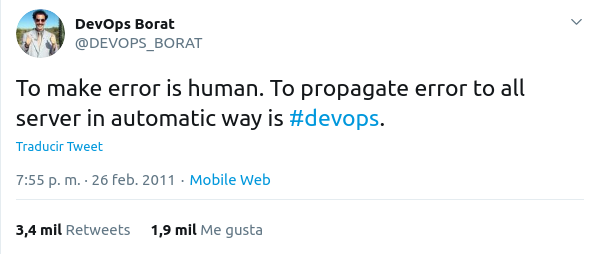

# DISCLAIMER

Este es el borrador del artículo publicado en: https://darecode.com/blog/como-controlar-repositorio-ansible-con-filtros/

# Introducción 

Hola y bienvenido a este primer artículo donde hablaré un poco de ansible. [Ansible](https://www.ansible.com/) es una herramienta de gestión de la configuración y orquestación desarrollado en [python](https://www.python.org/) comprada hace un tiempo por [RedHat](https://www.redhat.com/).  

Es un artículo introductorio, pero se supone que sabes los conceptos de [playbook](https://docs.ansible.com/ansible/latest/user_guide/playbooks.html) y [role](https://docs.ansible.com/ansible/latest/user_guide/playbooks_reuse_roles.html). Si no los sabes, en este artículo te dejo una sección de enlaces para aprender ansible, o si lo prefieres escríbemos algún comentario e intentamos ayudarte 😛 

# Objetivo 

Vamos a ver como los filtros de ansible nos pueden ayudar a tener nuestro repositorio de ansible bajo control y evitando repeticiones inncesarias. 

Para esto, vamos a poner un ejemplo de organización de variables en nuestro de repositorio de ansible.

No olvidemos que nuestra automatización debe ser lo más descriptiva y clara posible, recuerda que "_un gran poder conlleva una gran responsabilidad_". 

Si no lo hacemos así, nuestro amigo [Borat](https://twitter.com/devops_borat) vendrá tarde o temprano a visitarnos y nos contará algo como ..



# Metodología 

[Abraham Lincoln](https://es.wikipedia.org/wiki/Abraham_Lincoln) dijo:

> _Si dispusiera de ocho horas para cortar un árbol, emplearía seis en afilar el hacha._

Vamos a seguir esa filosofía, primero definimos nuestro estado final, y después pasaremos a la acción. Así, si se nos complica la cosa, siempre tendremos claro cuales son nuestros objetivos. 


Para que sea más comprensible el proceso, que es realmente lo interesante, vamos a ir haciendo pequeñas iteraciones (baby steps). ¿ Empezamos ?

# Punto de partida 

Cuando desarrollamos cualquier role, tenemos que hacerlo de la forma más desacoplada posible de una futura integración. Así, nuestro role puede evolucionar de manera independiente.

Vamos a poner un ejemplo, empecemos con un role de una persona bastante respetada dentro de la comunidad de ansible, su nombre es [Jeff Geerling](https://twitter.com/geerlingguy). El rol en particular, es su role de [docker](https://github.com/geerlingguy/ansible-role-docker).

Entre sus variables, nos pide una lista de nombres de usuarios que serán añadidos dentro del grupo de docker para que puedan usar docker: 

```yml
docker_users:
  - user1
  - user2
```

En el contexto del role y su espacio de nombres, el nombre de la variable es perfecto. 

También, vamos a suponer que tenemos otro role con nombre “**_sudo_**” que y nos ofrecen otras dos variables donde podemos poner nuestros usuario que queremos que puedan usar sudo (con o sin contraseña): 

```yml
sudo_with_password_users:
  - user1
  - user2
sudo_without_password_users:
  - user1
  - user2
```
 

Por supuesto, tenemos un role o playbook que nos crea los usuarios de nuestros entornos, podemos tener algo como:

```yml
common_users: 
  - name: user1 
    state: present 
    group: group1  

  - name: user2 

  - name: user3 
    group: group2 
```
 

Para finalizar, tenemos el role de nuestra aplicación que nos va a jubilar del éxito, y necesita conocer el usuario que se usará para lanzar la aplicación. Ojo no es un lista, es un texto con el nombre del usuario, algo como:

```yml
app_username: user3 
```

## Aplicación en nuestro entorno 

Con todo esto de forma abstracta, queremos aplicar lo siguiente en nuestro caso: 

Usuarios a definir: 
* john
* peter
* anthony
* margaret
* july
* mary

Los usuarios que pueden usar docker son: 

* margaret
* july

Los usuarios que pueden usar sudo sin clave son: 

* john
* peter

Los usuarios que pueden usar sudo con clave son: 

* anthony

El usuario de nuestra aplicación es *mary*, y sólo puede existir uno. 


## Software necesario

Si quieres seguir el artículo e ir haciéndolo poco a poco necesitarás ansible y [jmespath](https://jmespath.org/).

La instalación la puedes hacer por ejemplo mediante pip:

```bash
pip install ansible jmespath
```

JMESPath es un lenguaje de consultas para JSON que nos permite usar el filtro de JSON dentro de ansible. Realmente es bastante potente.


# Desarrollo

## Definición de test en ansible 

Antes de hacer nada, y como hablamos al principio vamos a definirmos un playbook sencillo que contenga nuestros tests, y que por supuesto fallará de forma estrepitosa. Pero lo que quiero es tener de una forma descriptiva y primitiva el resultado final, el resultado lo tienes en [00_playbook.yml](00_playbook.yml)

```yml
---
- hosts: localhost
  connection: local
  gather_facts: no
  vars:
    dockers_users: []
    sudo_with_password_users: []
    sudo_without_password_users: []
    common_users: []
    app_username: ''

  tasks:
    - name: Checking common_users
      assert:
        that:
          - common_users is defined
          - common_users | length == 6
        fail_msg: Not all the users are included
      ignore_errors: yes

    - name: Checking docker users
      assert:
        that: 
          - docker_users is defined
          - docker_users | length == 2
          - '"margaret" in docker_users'
          - '"july" in docker_users'
        fail_msg: Margaret and July only should be in docker_users
      ignore_errors: yes

    - name: Checking sudo user without password
      assert:
        that: 
          - sudo_without_password_users is defined
          - sudo_without_password_users | length == 2
          - '"john" in sudo_without_password_users'
          - '"peter" in sudo_without_password_users'
        fail_msg: John and Peter only should be in sudo_without_password_users
      ignore_errors: yes

    - name: Checking sudo user with password
      assert:
        that: 
          - sudo_with_password_users is defined
          - sudo_with_password_users | length == 1
          - '"anthony" in sudo_with_password_users'
        fail_msg: Anthony only should be in sudo_with_password_users
      ignore_errors: yes

    - name: Checking that Mary is the app user in the hosts
      assert:
        that:
          - '"mary" == app_username'
        fail_msg: Mary should be the user for the app
      ignore_errors: yes
```

Si lo ejecutamos evidentemente fallaran todos los tests

```bash
$ ansible-playbook 00_playbook.yml
[WARNING]: provided hosts list is empty, only localhost is available. Note that the implicit localhost
does not match 'all'

PLAY [localhost] ****************************************************************************************

TASK [Checking common_users] ****************************************************************************
fatal: [localhost]: FAILED! => {
    "assertion": "common_users | length == 6",
    "changed": false,
    "evaluated_to": false,
    "msg": "Not all the users are included"
}
...ignoring

TASK [Checking docker users] ****************************************************************************
fatal: [localhost]: FAILED! => {
    "assertion": "docker_users is defined",
    "changed": false,
    "evaluated_to": false,
    "msg": "Margaret and July only should be in docker_users"
}
...ignoring

TASK [Checking sudo user without password] **************************************************************
fatal: [localhost]: FAILED! => {
    "assertion": "sudo_without_password_users | length == 2",
    "changed": false,
    "evaluated_to": false,
    "msg": "John and Peter only should be in sudo_without_password_users"
}
...ignoring

TASK [Checking sudo user with password] *****************************************************************
fatal: [localhost]: FAILED! => {
    "assertion": "sudo_with_password_users | length == 1",
    "changed": false,
    "evaluated_to": false,
    "msg": "Anthony only should be in sudo_with_password_users"
}
...ignoring

TASK [Checking that Mary is the app user in the hosts] **************************************************
fatal: [localhost]: FAILED! => {
    "assertion": "\"mary\" == app_username",
    "changed": false,
    "evaluated_to": false,
    "msg": "Mary should be the user for the app"
}
...ignoring

PLAY RECAP **********************************************************************************************
localhost                  : ok=5    changed=0    unreachable=0    failed=0    skipped=0    rescued=0    ignored=5 
```

Aunque parezca que es perder el tiempo, ya tenemos bastante avanzado.


## Primera iteración (sin filtros)

Ahora vamos a hacer que sólo funcione de una forma muy ruda y primitiva, funciona no será nuestra versión final. La versión es exactamente igual a la anterior, pero simplemente hemos rellenado las variables, ahora tienen esta pinta:

```yml
  vars:
    common_users:
      - name: margaret
      - name: july
      - name: john
      - name: peter
      - name: anthony
      - name: mary
    docker_users:
      - margaret
      - july
    sudo_without_password_users:
      - john
      - peter
    sudo_with_password_users:
      - anthony
    app_username: mary
```

El fichero de este paso es [01_playbook.yml](01_playbook.yml)

### Conclusiones 

Hay muchísima de repetición de nombres, y cara a futuro es poco mantenible y propenso a errores, podría por ejemplo escribir *margaret* en common_users y *margarit* en docker_users, empezando a tener esos errores que tan poco nos gustan. Además hay veces que son evidentes y otras no.

### Ejecución completa de este paso

```bash
ansible-playbook 01_playbook.yml
[WARNING]: provided hosts list is empty, only localhost is available. Note that the implicit localhost
does not match 'all'

PLAY [localhost] ****************************************************************************************

TASK [Checking common_users] ****************************************************************************
ok: [localhost] => {
    "changed": false,
    "msg": "All assertions passed"
}

TASK [Checking docker users] ****************************************************************************
ok: [localhost] => {
    "changed": false,
    "msg": "All assertions passed"
}

TASK [Checking sudo user without password] **************************************************************
ok: [localhost] => {
    "changed": false,
    "msg": "All assertions passed"
}

TASK [Checking sudo user with password] *****************************************************************
ok: [localhost] => {
    "changed": false,
    "msg": "All assertions passed"
}

TASK [Checking that Mary is the app user in the hosts] **************************************************
ok: [localhost] => {
    "changed": false,
    "msg": "All assertions passed"
}

PLAY RECAP **********************************************************************************************
localhost                  : ok=5    changed=0    unreachable=0    failed=0    skipped=0    rescued=0    ignored=0 
```

## Segunda iteración

Ahora que tengo funcionando me planteo si toda esta parte que hace referencia a usuarios, no podría en un único sitio y después ir explotando esa información. Como quiero dar pasos pequeños iré de los más sencillos a los más complicados. En este caso, lo más asequible es crearme una estructura users copiando como user y después referenciándolo. Aunque suene un poco raro, verás que es muy fácil.

```yml
    users:
      - name: margaret
      - name: july
      - name: john
      - name: peter
      - name: anthony
      - name: mary
    
    common_users: "{{ users }}"
```

Como siempre si quieres ver el fichero entero lo tienes en [02_playbook.yml](02_playbook.yml)

### Conclusiones

Aunque este pequeño cambio, parece que no es nada, ya hemos creado nuestra estructura que contendrá al resto. Estamos en el buen camino.

### Ejecución completa de este paso

```bash
$ ansible-playbook 02_playbook.yml
[WARNING]: provided hosts list is empty, only localhost is available. Note that the implicit localhost
does not match 'all'

PLAY [localhost] ****************************************************************************************

TASK [Checking common_users] ****************************************************************************
ok: [localhost] => {
    "changed": false,
    "msg": "All assertions passed"
}

TASK [Checking docker users] ****************************************************************************
ok: [localhost] => {
    "changed": false,
    "msg": "All assertions passed"
}

TASK [Checking sudo user without password] **************************************************************
ok: [localhost] => {
    "changed": false,
    "msg": "All assertions passed"
}

TASK [Checking sudo user with password] *****************************************************************
ok: [localhost] => {
    "changed": false,
    "msg": "All assertions passed"
}

TASK [Checking that Mary is the app user in the hosts] **************************************************
ok: [localhost] => {
    "changed": false,
    "msg": "All assertions passed"
}

PLAY RECAP **********************************************************************************************
localhost                  : ok=5    changed=0    unreachable=0    failed=0    skipped=0    rescued=0    ignored=0   
```

## Tercera iteración.

Aquí es realmente donde empezamos a usar filtros, vamos a intentar extraer los usuarios de nuestra estructura de usuarios "**_users_**", para eso vamos a añadir la siguiente lógica. Añado un nuestro campo opcional, que sea con clave "**_docker_**" y valor booleano. En caso de no poner el campo, se sobreentiende que no será un usuario que pueda ejecutar docker. Es decir, podemos tener nuestra parte de users así:

```yml
    users:
      - name: margaret
        docker: true
      - name: july
        docker: true
      - name: john
        docker: false
      - name: peter
      - name: anthony
      - name: mary
```

Este paso vamos a hacerlo con filtros, y podemos hacerlo de dos formas distintas con y sin _jmespath_ (json_query) que nos permite consultas más complejas 

### Filtro sin JMESPATH


```yml
    docker_users:  "{{ users |
                       selectattr('docker', 'defined') |
                       selectattr('docker', 'equalto', True) |
                       map(attribute='name') |
                       list }}"
```

El filtro básicamente de docker_users hace lo siguiente:

* Recoge el listado de users, comprueba de cada elemento que tenga la clave docker definida, y después comprueba que sea igual a true. Posteriormente sólo se queda con el valor de la clave '*name*' de cada elemento y nos devuelve una lista.

### Filtro con JMESPATH

```yml
    jmespath_docker_users: "{{ users | json_query('[?docker].name') }}"
```

### Adaptación de los TEST

En este caso, vemos como ha quedado más claro con jmespath, pero lo importante es que el resultado sea el mismo. Como puedes observar lo que extraigo con jmespath le puesto el prefijo jmespath, por lo que ahora debo modificar los tests para que comprueben ámbas variables.

El test quedaría de la siguiente manera:

```yml
    - name: Checking docker users
      assert:
        that: 
          - docker_users is defined
          - docker_users | length == 2
          - '"margaret" in docker_users'
          - '"july" in docker_users'
          - docker_users == jmespath_docker_users
        fail_msg: Margaret and July only should be in docker_users
```

De esta manera compruebo que ámbas contienen lo mismo en el último aserto.

El fichero entero de esta iteración es [03_playbook.yml](03_playbook.yml)

### Conclusiones

Ya parece que esto empieza a coger forma, y estamos organizando las cosas.

### Ejecución completa de este paso

```bash
$ ansible-playbook 04_playbook.yml
[WARNING]: provided hosts list is empty, only localhost is available. Note that the implicit localhost
does not match 'all'

PLAY [localhost] ****************************************************************************************

TASK [Checking common_users] ****************************************************************************
ok: [localhost] => {
    "changed": false,
    "msg": "All assertions passed"
}

TASK [Checking docker users] ****************************************************************************
ok: [localhost] => {
    "changed": false,
    "msg": "All assertions passed"
}

TASK [Checking sudo user without password] **************************************************************
ok: [localhost] => {
    "changed": false,
    "msg": "All assertions passed"
}

TASK [Checking sudo user with password] *****************************************************************
ok: [localhost] => {
    "changed": false,
    "msg": "All assertions passed"
}

TASK [Checking that Mary is the app user in the hosts] **************************************************
ok: [localhost] => {
    "changed": false,
    "msg": "All assertions passed"
}

PLAY RECAP **********************************************************************************************
localhost                  : ok=5    changed=0    unreachable=0    failed=0    skipped=0    rescued=0    ignored=0   

```

## Cuarta iteración

Aquí vamos a ejecutar un momento el módulo de debug de ansible, porque creo que estamos metiendo datos que no nos interesan o no eran los iniciales en nuestra variables common_users. Lo que ejecutaríamos tendríamos que escribir sería algo así en el playbook (dentro de la sección de _tasks_):

```yml
    - name: Show common_users var
      debug:
        msg: "common_users: {{ common_users }}"
```

Ejecutamos nuestro playbook y vemos lo siguiente:

```bash
TASK [Show common_users var] ****************************************************************************
TASK [Show common_users var] ****************************************************************************
ok: [localhost] => {
    "msg": "common_users: [{'name': 'margaret', 'docker': True}, {'name': 'july', 'docker': True}, {'name': 'john', 'docker': False}, {'name': 'peter'}, {'name': 'anthony'}, {'name': 'mary'}]"
}
....
```

Estamos pasando todo los campos de users, cuando en nuestro ejemplo, sólo queremos pasar "**_name_**", igual es tu caso da igual, pero vamos a corregir "**_common_users_**" para que sólo muestre el atributo "**_name_**" como estaba originalmente. 

### Filtro sin JMESPATH

```yml
    common_users: "{{ users | map(attribute='name') | list }}"
```

### Filtro con JMESPATH

Como referencia voy a poner el filtro para hacer lo mismo con jmespath

```yml
jmespath_common_users: "{{ users | json_query('[].name') }}"
```

### Comprobaciones

Volvemos a ejecutar y vemos que ya tenemos nuestro problema arreglado:

```bash
TASK [Show common_users var] ****************************************************************************
ok: [localhost] => {
    "msg": "common_users: ['margaret', 'july', 'john', 'peter', 'anthony', 'mary']"
}
```


Voy a ampliar los tests para comprobar que **_common_users_** y **_jmespath_common_users_**

```yml
    - name: Checking common_users
      assert:
        that:
          - common_users is defined
          - common_users | length == 6
          - common_users == jmespath_common_users
        fail_msg: Not all the users are included
```

Lo que no está hecho, y lo dejo como ejercicio del lector, hacer un test que compruebe que "**_users_**" sólo contiene las claves que debe tener. 

El fichero de este paso es [04_playbook.yml](04_playbook.yml)

### Conclusión

Aunque los tests nos ayudan, hay que tener cuidado, porque igual no tenemos todos los casos contemplados.


## Quinta iteración

Ya nos va quedando menos, hemos aprendido a hacer un filtro para variables de tipo booleano, y nos hemos dado cuenta de algún fallo o feature, que lo hemos ajustado sobre la marcha.

En esta ocasión, vamos a atacar el tema del sudo, en este caso, en este caso, vamos a suponer la siguiente lógica.

* Creamos una clave en nuestra estructura de usuarios llamada "**_sudo_**", que puede tener los siguientes valores "_with_password_", "_without_password_". Si contiene otra cosa o no tiene la clave, daremos por sentado que no usará sudo.

Nuestra variable users podría quedar de la siguiente manera:

```yml
  vars:
    users:
      - name: margaret
        docker: true
      - name: july
        docker: true
      - name: john
        docker: false
        sudo: without_password
      - name: peter
        sudo: without_password
      - name: anthony
        sudo: with_password
      - name: mary
```

Como en la iteración tercera, vamos a hacerlo con y sin jmespath.

### Filtro sin JMESPATH

Vamos a ver como quedaría la versión sin jmespath, para los dos grupos que debemos crear:

```yml
    sudo_without_password_users: "{{ users |
                                     selectattr('sudo', 'defined') |
                                     selectattr('sudo', 'equalto', 'without_password') |
                                     map(attribute='name') |
                                     list }}"
    sudo_with_password_users:    "{{ users |
                                     selectattr('sudo', 'defined') |
                                     selectattr('sudo', 'equalto', 'with_password') |
                                     map(attribute='name') |
                                     list }}"
```

### Filtro con JMESPATH

Ahora veamos el ejemplo con jmespath:

```yml
    jmespath_sudo_without_password_users: "{{ users |
                                              json_query(\"[?sudo=='without_password'].name\") }}"

    jmespath_sudo_with_password_users:    "{{ users |
                                              json_query(\"[?sudo=='with_password'].name\") }}"
```

### Adaptación de los TEST

Ahora sólo nos quedaría modificar un poco el test, para que compruebe que las dos variabels contienen lo mismo:

```yml
    - name: Checking sudo user without password
      assert:
        that: 
          - sudo_without_password_users is defined
          - sudo_without_password_users | length == 2
          - '"john" in sudo_without_password_users'
          - '"peter" in sudo_without_password_users'
          - sudo_without_password_users == jmespath_sudo_without_password_users
        fail_msg: John and Peter only should be in sudo_without_password_users

    - name: Checking sudo user with password
      assert:
        that: 
          - sudo_with_password_users is defined
          - sudo_with_password_users | length == 1
          - '"anthony" in sudo_with_password_users'
          - sudo_with_password_users == jmespath_sudo_with_password_users
        fail_msg: Anthony only should be in sudo_with_password_users
```

El fichero de este paso lo tienes en [05_playbook.yml](05_playbook.yml)

### Conclusiones
Esto está quedando mucho más organizado, y casi no tenemos que repetir nada. Ánimo que ya casi hemos acabado.

### Ejecución completa de este paso

```bash
ansible-playbook 05_playbook.yml
[WARNING]: provided hosts list is empty, only localhost is available. Note that the implicit localhost
does not match 'all'

PLAY [localhost] ****************************************************************************************

TASK [Show common_users var] ****************************************************************************
ok: [localhost] => {
    "msg": "common_users: ['margaret', 'july', 'john', 'peter', 'anthony', 'mary']"
}

TASK [Checking common_users] ****************************************************************************
ok: [localhost] => {
    "changed": false,
    "msg": "All assertions passed"
}

TASK [Checking docker users] ****************************************************************************
ok: [localhost] => {
    "changed": false,
    "msg": "All assertions passed"
}

TASK [Checking sudo user without password] **************************************************************
ok: [localhost] => {
    "changed": false,
    "msg": "All assertions passed"
}

TASK [Checking sudo user with password] *****************************************************************
ok: [localhost] => {
    "changed": false,
    "msg": "All assertions passed"
}

TASK [Checking that Mary is the app user in the hosts] **************************************************
ok: [localhost] => {
    "changed": false,
    "msg": "All assertions passed"
}

PLAY RECAP **********************************************************************************************
localhost                  : ok=6    changed=0    unreachable=0    failed=0    skipped=0    rescued=0    ignored=0  
```


## Sexta iteración

En esta última ejecución, vamos a poner a abordar el caso de usuario que se usará para arrancar nuestra aplicación, ahora lo que queremos es un valor, no una lista de elementos, para eso vamos a usar un filtro que no acabará en lista, y cogeremos el primer valor positivo que nos encontremos. 


Nuestra parte de users quedaría de la siguiente manera:

 ```yml
   vars:
    users:
      - name: margaret
        docker: true
      - name: july
        docker: true
      - name: john
        docker: false
        sudo: without_password
      - name: peter
        sudo: without_password
      - name: anthony
        sudo: with_password
      - name: mary
        app_user: true
 ```

Vamos a ver las versiones de nuestro filtro, como siempre, con y sin jmespath.

Hemos decidido que la clave para este nuestro valor será app_user y tendrá un valor booleano a verdadero.

### Filtro sin JMESPATH

```yml
    app_username: "{{ users |
                      selectattr('app_user', 'defined') |
                      selectattr('app_user', 'equalto', True) |
                      map(attribute='name') |
                      first }}"
```

### Filtro con JMESPATH

```yml
    jmespath_app_username: "{{ users | json_query(\"[?app_user].name | [0] \") }}"
```

Por último como siempre, modificamos los tests para ver que ámbas variables son iguales

```yml
    - name: Checking that Mary is the app user in the hosts
      assert:
        that:
          - '"mary" == app_username'
          - app_username == jmespath_app_username
        fail_msg: Mary should be the user for the app
```

### ¿ Realmente hemos terminado ?

Lanzamos nuestros test, y todo sale en verde, pero que pasaría si por error le pongo también a john el atributo de *app_user* a true, es decir, tendría esto en *users*:

```yml
  vars:
    users:
      - name: margaret
        docker: true
      - name: july
        docker: true
      - name: john
        docker: false
        app_user: true
        sudo: without_password
      - name: peter
        sudo: without_password
      - name: anthony
        sudo: with_password
      - name: mary
        app_user: true
```

Vuelvo a lanzar y ...

```bash
$ ansible-playbook 06_playbook.yml
...

TASK [Checking that Mary is the app user in the hosts] **************************************************
fatal: [localhost]: FAILED! => {
    "assertion": "\"mary\" == app_username",
    "changed": false,
    "evaluated_to": false,
    "msg": "Mary should be the user for the app"
}

PLAY RECAP **********************************************************************************************
localhost                  : ok=6    changed=0    unreachable=0    failed=1    skipped=0    rescued=0    ignored=0   
```

Nos podemos volver locos buscando donde está el fallo, porque mary está marcada como app_user, para corregir este caso, podemos poner una prueba más en los tests que nos compruebe que sólo un usuario tiene esa propiedad como *true*, vamos a ver como lo haríamos:

```yml
    - name: Checking that Mary is the app user in the hosts
      vars:
        number_of_users_with_app_username: "{{ users |
                                               json_query(\"[?app_user].name\") |
                                               length }}"
      assert:
        that:
          - number_of_users_with_app_username == '1'
          - '"mary" == app_username'
          - app_username == jmespath_app_username
        fail_msg: Mary should be the user for the app
```

Ahora cuando el test falla lo hace porque ha encontrado varios usuarios con esa propiedad, lo que nos da más pistas y es más fácil de depurar.

```bash
$ ansible-playbook 06_playbook.yml
...
TASK [Checking that Mary is the app user in the hosts] **************************************************
fatal: [localhost]: FAILED! => {
    "assertion": "number_of_users_with_app_username == '1'",
    "changed": false,
    "evaluated_to": false,
    "msg": "Mary should be the user for the app"
}

PLAY RECAP **********************************************************************************************
localhost                  : ok=5    changed=0    unreachable=0    failed=1    skipped=0    rescued=0    ignored=0 
```

Corregimos el fallo y todo sale perfectamente.

El fichero de este paso es [06_playbook.yml](06_playbook.yml)

### Conclusiones

Esta última ejecución nos ha dejado nuestras variables bastante limpias, más mantenible y gestionable en el futuro. 

Nuestras variables podrían terminar de la siguiente manera:

```yml
  vars:
    users:
      - name: margaret
        docker: true
      - name: july
        docker: true
      - name: john
        docker: false
        sudo: without_password
      - name: peter
        sudo: without_password
      - name: anthony
        sudo: with_password
      - name: mary
        app_user: true
    
    common_users: "{{ users | json_query('[].name') }}"

    docker_users: "{{ users | json_query('[?docker].name') }}"

    sudo_without_password_users: "{{ users | json_query(\"[?sudo=='without_password'].name\") }}"

    sudo_with_password_users: "{{ users | json_query(\"[?sudo=='with_password'].name\") }}"

    app_username: "{{ users | json_query(\"[?app_user].name | [0] \") }}"
```

### Ejecución completa de este paso

```bash
ansible-playbook 06_playbook.yml
[WARNING]: provided hosts list is empty, only localhost is available. Note that the implicit localhost
does not match 'all'

PLAY [localhost] ****************************************************************************************

TASK [Show common_users var] ****************************************************************************
ok: [localhost] => {
    "msg": "common_users: ['margaret', 'july', 'john', 'peter', 'anthony', 'mary']"
}

TASK [Checking common_users] ****************************************************************************
ok: [localhost] => {
    "changed": false,
    "msg": "All assertions passed"
}

TASK [Checking docker users] ****************************************************************************
ok: [localhost] => {
    "changed": false,
    "msg": "All assertions passed"
}

TASK [Checking sudo user without password] **************************************************************
ok: [localhost] => {
    "changed": false,
    "msg": "All assertions passed"
}

TASK [Checking sudo user with password] *****************************************************************
ok: [localhost] => {
    "changed": false,
    "msg": "All assertions passed"
}

TASK [Checking that Mary is the app user in the hosts] **************************************************
ok: [localhost] => {
    "changed": false,
    "msg": "All assertions passed"
}

PLAY RECAP **********************************************************************************************
localhost                  : ok=6    changed=0    unreachable=0    failed=0    skipped=0    rescued=0    ignored=0   
```

# Recursos para aprender ansible

A continuación te expongo recursos de ansible que recomendaría:

* [Documentación de ansible](https://docs.ansible.com/)
* [Ansible for DevOps](https://www.ansiblefordevops.com/)
* [Ansible 101 YouTube Playlist](https://www.youtube.com/playlist?list=PL2_OBreMn7FqZkvMYt6ATmgC0KAGGJNAN)
* [Presentación de Ansible en Español](https://docs.google.com/presentation/d/1RLjwFalGl9pz6c5wgWT6gpVv-_SXVUxH2sgR3VtUeIk/edit?usp=sharing) (auto bombo del autor)

# Recursos para este artículo

* https://stackoverflow.com/questions/57858362/ansible-how-to-use-selectattr-with-yaml-of-different-keys
* https://stackoverflow.com/questions/41581273/search-dictionary-values-in-ansible
* https://gist.github.com/halberom/3659c98073efcabd91ed1dec3ad63fa3
* https://stackoverflow.com/questions/54334751/ansible-selectattr-map-list-returns-empty-result
* https://oznetnerd.com/2017/04/18/jinja2-selectattr-filter/
